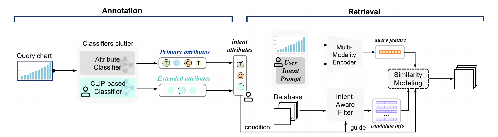
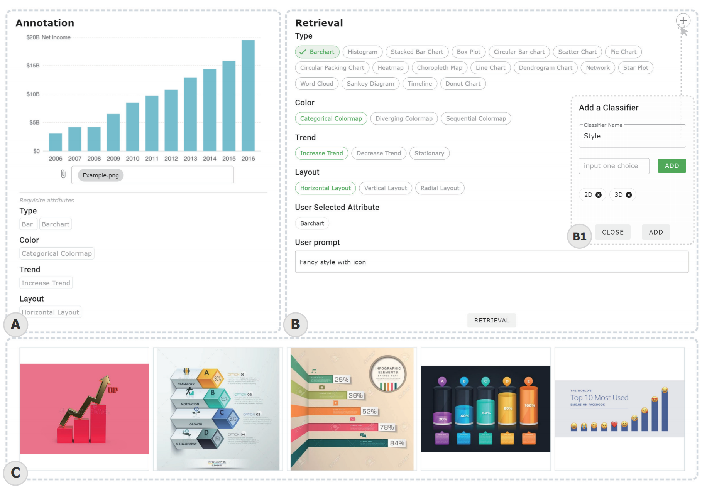
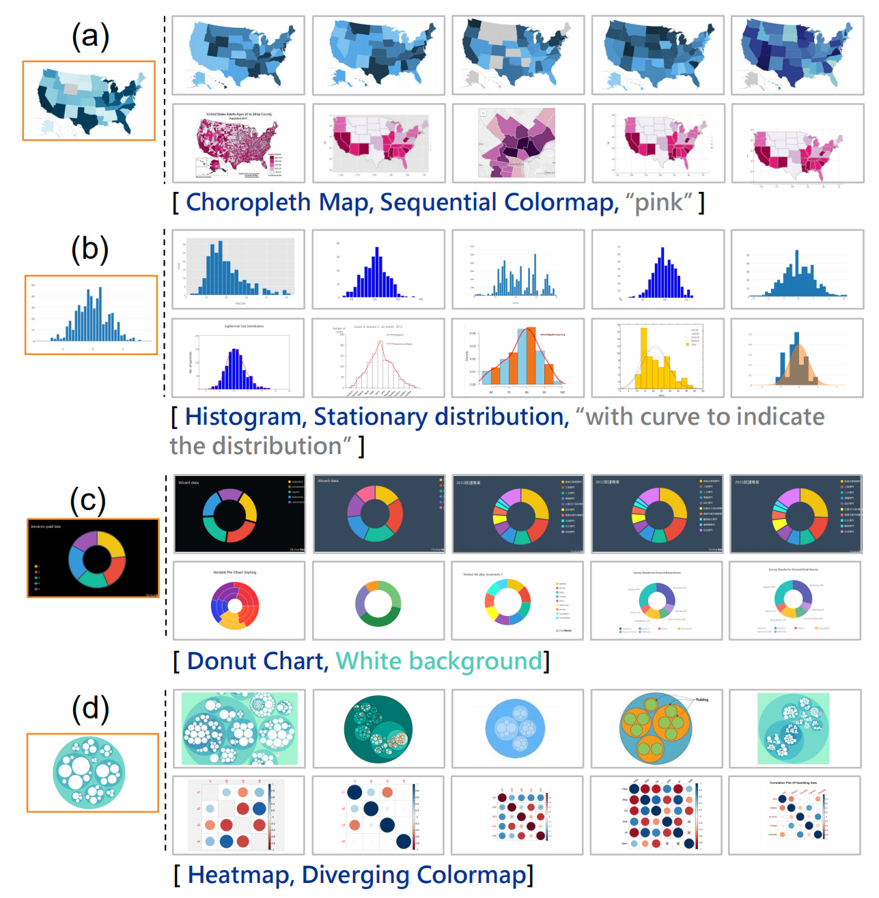
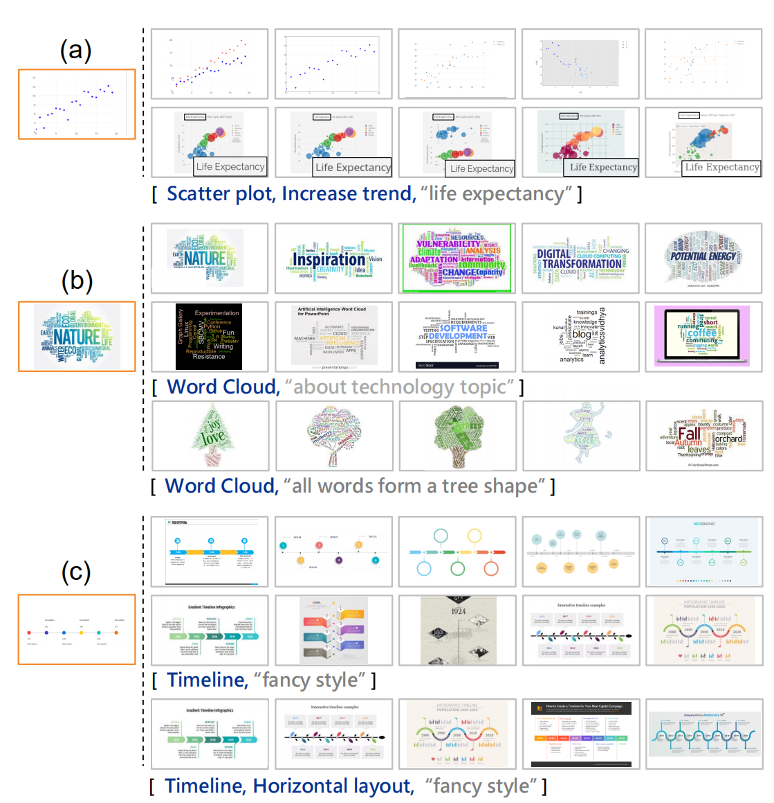

# **WYTIWYR:** A User Intent-Aware Framework with Multi-modal Inputs for Visualization Retrieval

This repository contains the code for a user intent-aware framework with multi-modal inputs for visualization retrieval, which consists of two stages: first, the Annotation stage disentangles the visual attributes within the query chart; and second, the Retrieval stage embeds the user’s intent with customized text prompt as well as bitmap query chart, to recall targeted retrieval result. 





The detail of the framework can be referred to the original paper and it would update after it is published.         

## **Dependencies and Installation**

```bash
git clone https://github.com/SerendipitysX/WYTIWYR.git
cd WYTIWYR
conda create --name <environment_name> --file requirements.txt
```

## **Dataset Preparation**

Our dataset includes synthetic charts from [Beagle dataset](https://homes.cs.washington.edu/~leibatt/beagle.html) and real-world cases from the Internet, with a total of 18 chart types and 33,260 images. Additionally, we provide additional attribute information and extracted features; the detailed description can be found in the `description.md` file (click here).

To use the dataset, please follow the steps below:

1. Download the dataset from [here](https://drive.google.com/drive/folders/1pkwgMYNz0OgsjZO0C3LkiJEGEUE7UJYx?usp=share_link).
2. Unzip the folder and save it to `data/`.

## Pretrained Model

In this work, we benefit from some excellent pretrained models, including [CLIP](https://github.com/openai/CLIP) for aligning multi-modal features and [DIS](https://github.com/xuebinqin/DIS) for background removal. To inform future work, we also provide pretrained attribute classifiers as well as training code.

To use these models, please follow the steps below:

1. Download the pretrained models from [here](https://drive.google.com/drive/folders/1o-VFpRX7wmBgeVXQ75lAOOoj5bLh8s5Y?usp=share_link).
2. Unzip the folder and save it to `models/`.

## Backend Setup

Following WYTIWYR framework, there are two stage namely *Annotation* and *Retrieval*. Before settng up these two file, make sure the ip adress and port right. Also the You can specify paramenter $\nu$ and $\mu$ to adjust the weight of attribute and user prompt as descripted in paper.

$$
\mathcal{S} = S_{\mathcal{Q}} \cdot \text{e}^{\nu  S_{\mathcal{I}_A} +\mu  S_{\mathcal{M}}}
$$

To run annotation, 

```bash
python annotation.py --ip 'localhost' --port 7779
```

To run retrieval,

```bash
python retrieval.py --ip 'localhost' --port 7780 --mu 5 --nu 1 
```

## Frontend Setup

### Environment Setup

1.  Set up Node.js and  environment. Please refer to [here](https://www.digitalocean.com/community/tutorials/node-js-environment-setup-node-js-installation)
2.  Set up Vue.js environment:  `npm install vue`

### Host Setting

In file `WYTIWYR\frontend\retrieval\src\store\index.ts`, please set the host that run your backend

```js
import Vue from "vue";
import Vuex from "vuex";

Vue.use(Vuex);

export default new Vuex.Store({
  state: {
    watchlst: ["all_attributes.Type"],
    annotation_host: "http://10.30.11.33:7779/", // change to your own hosts
    retrieval_host: "http://10.30.11.33:7780/",
...
```

### Project Setup

1. Go to `WYTIWYR\frontend\retrieval` path

2. Install all the needed packages through npm

   ```
   npm install
   ```

3. Compiles and hot-reloads for development

   ```
   npm run serve
   ```

#### Compiles and minifies for production

```
npm run build
```

## Cases

To show users can customize retrieval inputs based on disentangled attributes of the query chart and intent prompt, we explore two main use scenarios including design space extension by explicit goals and fuzzy retrieval by user intent. For design space extension by explicit goals, we Investigated 4 cases, namely (a) original attribute change, (b) new attribute addition, (c) existing attribute deletion, (d) attribute transfer, see the figure below for detail. 


For fuzzy retrieval by user intent, we Investigated 3 cases, namely (a) text information seeking, (b) relevant topic finding, (c) abstract description searching, see the figure below for detail.


## Failure Cases

## **Contact**

We are glad to hear from you. If you have any questions, please feel free to contact [xrakexss@gmail.com](mailto:xrakexss@gmail.com) or open issues on this repository.
